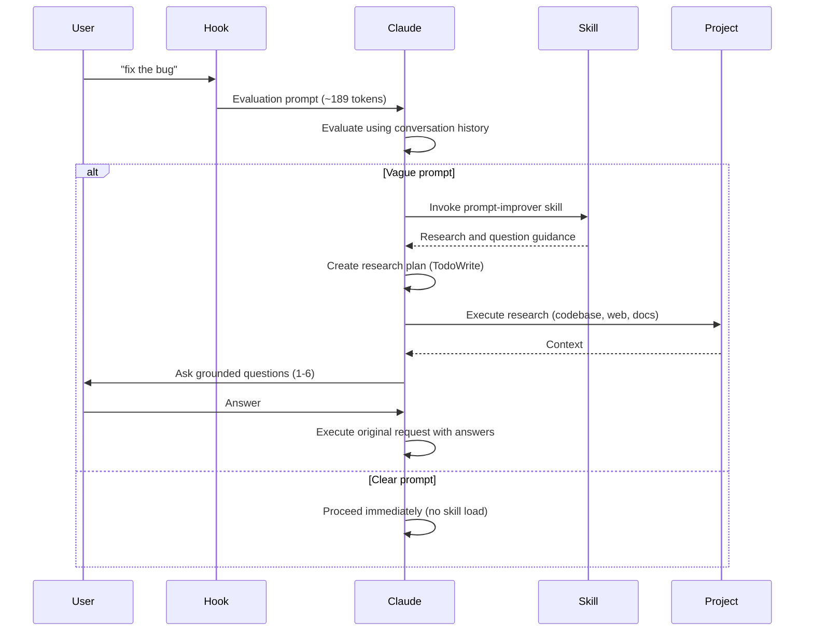

# Claude Code Prompt Improver

A UserPromptSubmit hook that enriches vague prompts before Claude Code executes them. Uses the AskUserQuestion tool (Claude Code 2.0.22+) for targeted clarifying questions.


## What It Does

Intercepts prompts and evaluates clarity. Claude then:
- Checks if the prompt is clear using conversation history
- For clear prompts: proceeds immediately (zero overhead)
- For vague prompts: invokes the `prompt-improver` skill to create research plan, gather context, and ask 1-6 grounded questions
- Proceeds with original request using the clarification

**Result:** Better outcomes on the first try, without back-and-forth.

**v0.4.0 Update:** Skill-based architecture with hook-level evaluation achieves 31% token reduction. Clear prompts have zero skill overhead, vague prompts get comprehensive research and questioning via the skill.

## How It Works



## Installation

**Requirements:** Claude Code 2.0.22+ (uses AskUserQuestion tool for targeted clarifying questions)

### Option 1: Via Marketplace (Recommended)

**1. Add the marketplace:**
```bash
claude plugin marketplace add severity1/severity1-marketplace
```

**2. Install the plugin:**
```bash
claude plugin install prompt-improver@severity1-marketplace
```

**3. Restart Claude Code**

Verify installation with `/plugin` command. You should see the prompt-improver plugin listed.

### Option 2: Local Plugin Installation (Recommended for Development)

**1. Clone the repository:**
```bash
git clone https://github.com/severity1/claude-code-prompt-improver.git
cd claude-code-prompt-improver
```

**2. Add the local marketplace:**
```bash
claude plugin marketplace add /absolute/path/to/claude-code-prompt-improver/.dev-marketplace/.claude-plugin/marketplace.json
```

Replace `/absolute/path/to/` with the actual path where you cloned the repository.

**3. Install the plugin:**
```bash
claude plugin install prompt-improver@local-dev
```

**4. Restart Claude Code**

Verify installation with `/plugin` command. You should see "1 plugin available, 1 already installed".

### Option 3: Manual Installation

**1. Copy the hook:**
```bash
cp scripts/improve-prompt.py ~/.claude/hooks/
chmod +x ~/.claude/hooks/improve-prompt.py
```

**2. Update `~/.claude/settings.json`:**
```json
{
  "hooks": {
    "UserPromptSubmit": [
      {
        "hooks": [
          {
            "type": "command",
            "command": "python3 ~/.claude/hooks/improve-prompt.py"
          }
        ]
      }
    ]
  }
}
```

## Usage

**Normal use (default pass-through):**
```bash
claude "fix the bug"      # Direct execution, no evaluation
claude "add tests"        # Direct execution, no evaluation
```

**Trigger evaluation with `?` prefix:**
```bash
claude "? fix the bug"                    # ? = trigger evaluation
claude "? add tests"                      # ? = trigger evaluation
```

**Special prefixes:**
```bash
claude "/help"                              # / = slash commands (preserved)
claude "# remember to use rg over grep"     # # = memorize (preserved)
```

**Vague prompt (with `?` trigger):**
```bash
$ claude "? fix the error"
```

Claude asks:
```
Which error needs fixing?
  ○ TypeError in src/components/Map.tsx (recent change)
  ○ API timeout in src/services/osmService.ts
  ○ Other (paste error message)
```

You select an option, Claude proceeds with full context.

**Clear prompt:**
```bash
$ claude "Fix TypeError in src/components/Map.tsx line 127 where mapboxgl.Map constructor is missing container option"
```

Claude proceeds immediately without questions.

## Design Philosophy

- **User control** - Evaluation only when requested (`?` prefix)
- **Trust user intent** - Default pass-through mode
- **Zero overhead by default** - No evaluation unless triggered
- **Use conversation history** - Avoid redundant exploration when triggered
- **Max 1-6 questions** - Enough for complex scenarios, still focused
- **Transparent** - Evaluation visible in conversation

## Architecture

**v0.4.0:** Skill-based architecture with hook-level evaluation.

**Hook (scripts/improve-prompt.py) - Evaluation Orchestrator:**
- Intercepts via stdin/stdout JSON (~70 lines)
- Default pass-through mode (zero overhead)
- Trigger with `?` prefix for evaluation (~189 tokens)
- Preserves `/` (slash commands) and `#` (memorize)
- If vague: Instructs Claude to invoke `prompt-improver` skill

**Skill (skills/prompt-improver/) - Research & Question Logic:**
- **SKILL.md**: Research and question workflow (~170 lines)
  - Assumes prompt already determined vague by hook
  - 4-phase process: Research → Questions → Clarify → Execute
  - Links to reference files for progressive disclosure
- **references/**: Detailed guides loaded on-demand
  - `question-patterns.md`: Question templates (200-300 lines)
  - `research-strategies.md`: Context gathering (300-400 lines)
  - `examples.md`: Real transformations (200-300 lines)

**Flow for Clear Prompts (without `?` prefix):**
1. Hook passes through unchanged
2. Claude executes immediately
3. **Total overhead: 0 tokens**

**Flow for Evaluation Triggered (with `?` prefix):**
1. Hook wraps with evaluation prompt (~189 tokens)
2. Claude evaluates using conversation history
3. If clear: proceeds immediately (no skill invocation)
4. If vague: invokes `prompt-improver` skill for research/questions
5. **Total overhead: ~189 tokens + skill load (if vague)**

**Progressive Disclosure Benefits:**
- Clear prompts: Never load skill (zero skill overhead)
- Vague prompts: Only load skill and relevant reference files
- Detailed guidance available without bloating all prompts
- Zero context penalty for unused reference materials

**Why main session (not subagent)?**
- Has conversation history
- No redundant exploration
- More transparent
- More efficient overall

**Manual Skill Invocation:**
You can also invoke the skill manually without the hook:
```
Use the prompt-improver skill to research and clarify: "add authentication"
```

## Token Overhead

**v0.5.0 Update:** On-demand evaluation architecture

- **Default mode:** 0 tokens (pass-through)
- **With `?` trigger:** ~189 tokens (evaluation prompt)
- **Control:** User decides when evaluation is needed
- **Trade-off:** Zero overhead for most prompts, full evaluation when requested

**Default pass-through:**
- No evaluation wrapper
- Claude executes immediately
- Zero overhead

**Triggered evaluation (`?` prefix):**
- Evaluation wrapper (~189 tokens)
- Skill loads only if prompt is vague
- Progressive disclosure: reference files load on-demand

## FAQ

**Does this work on all prompts?**
Default mode passes through all prompts unchanged. Use `?` prefix to trigger evaluation.

**Will it slow me down?**
Only when you use `?` prefix and it asks questions. Faster overall due to better context when needed.

**Will I get bombarded with questions?**
No. You control when evaluation happens via `?` prefix. When triggered, it asks max 1-6 questions.

**Can I customize behavior?**
It adapts automatically using conversation history, dynamic research planning, and CLAUDE.md.

**What if I want evaluation?**
Use `?` prefix: `claude "? your prompt here"`

## License

MIT
